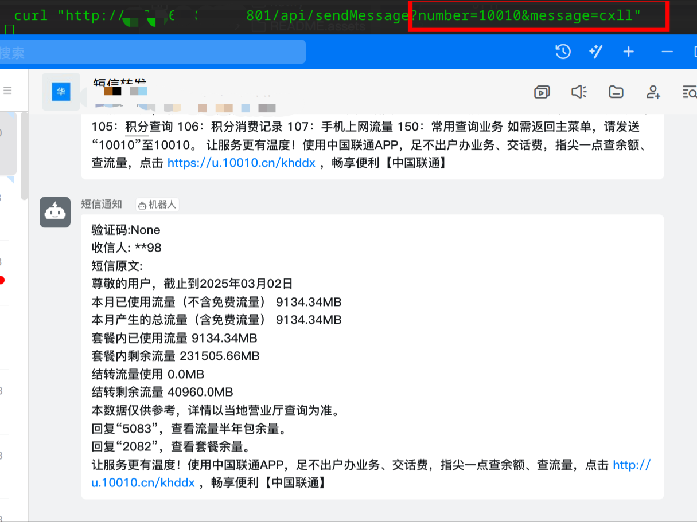
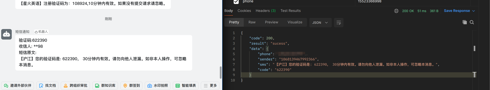

# jd_uz801

## uz801配置详情
| 项目 | 参数 |
|-----|------|
|CPU|MSM8916(高通410)|
|RAM|385MiB|
|ROM|3.82GiB|
|购入价|4.4 (我是大冤种，我哭死)|


## 使用简介
### 修改配置文件
第一次执行会生成`conf.yml`文件，需要修改的地方：
* notify 通知渠道，这个根据自己的通知的渠道修改
  * 支持的通知渠道
    * 邮箱
    * qq/wx  机器人容易封！请慎重
    * 自定义的get/post请求， 比如钉钉、FCM、华为推送、bark等。。
  * 支持多渠道通知，不过消息多感觉会很烦，通知渠道不好判断是否正常，只能同时发

* 短信保存地址，目前只用sqlite3数据库，方便其他程序代码获取验证码， 这个默认也行

### smsforwarder.service文件建议配置
```shell
ExecStartPre=/bin/sleep 10
# 服务挂后重新拉起
Restart=on-failure
```

##  交叉编译
* 安装aarch64-linux-gnu-gcc
```shell
apt install gcc-aarch64-linux-gnu 
```
* 编译
```shell
export CC=aarch64-linux-gnu-gcc
export CGO_ENABLED=1
export GOOS=linux
export GOARCH=arm64
```

## 版本说明

已实现功能：

* 接收短信
* 转发短信
  * qq
  * wx
  * mail
  * 自定义的GET/POST 请求
* 发送短信
  * 端口 801
  * 路径 /api/sendMessage
  * GET参数
    * number
    * message
    

* 获取验证码
  * 端口 801
  * 路径： /api/getMessage
  * GET参数
    * phone
    * verify(验证字符串，可忽略)
    
* 保存短信,sqlite3
* 执行shell命令
  * 端口 801
  * 路径： /api/cmd
  * GET参数
    * command
    
* 清理短信(规划中...)
  ...


写的比较垃圾，仅供学习。不要喷我行不行呀 好哥哥


## 刷入后优化
### 关闭所有led灯, 已经集成到beta3版本里面了 

如果是Archlinux 安装后会自动关闭

```shell
echo 0 > /sys/class/leds/green:internet/brightness
echo 0 > /sys/class/leds/blue:wifi/brightness
echo 0 > /sys/class/leds/mmc0::/brightness
```
### 修改中文
```shell
nano  /etc/locale.conf
# 将内容修改成下面的内容
LANG=zh_CN.UTF-8
```
或者用echo 直接重定向，这个准备后续集成到软件包内
```shell
echo 'LANG=zh_CN.UTF-8' >/etc/locale.conf 
```
然后执行一下
```shell
locale-gen
```
然后最好是重启一下
### 修改主机名
```shell
hostnamectl set-hostname SIM-号码

# 替换hosts文件原有的主机名
sed -i 's/UFI-Arch/SIM-号码/' /etc/hosts
```

###  修改密码
将root密码修改为自己记得住的
```shell
passwd root
```

### 安装python3

默认没装python3, ansible无法统一管理

```shell
pacman -Syy 
pacman -S python3 
```

### 空间清理

本身的存储就不大，可以多点空间出来

```shell
# 删除软件包缓存
rm -rf /var/cache/pacman/*

# 删除帮助手册
rm -rf /usr/share/doc/*

#  删除部分语言, 删除请确保以及将语言设置为中文
rm -rf /usr/share/locale/[a-y]*
```


