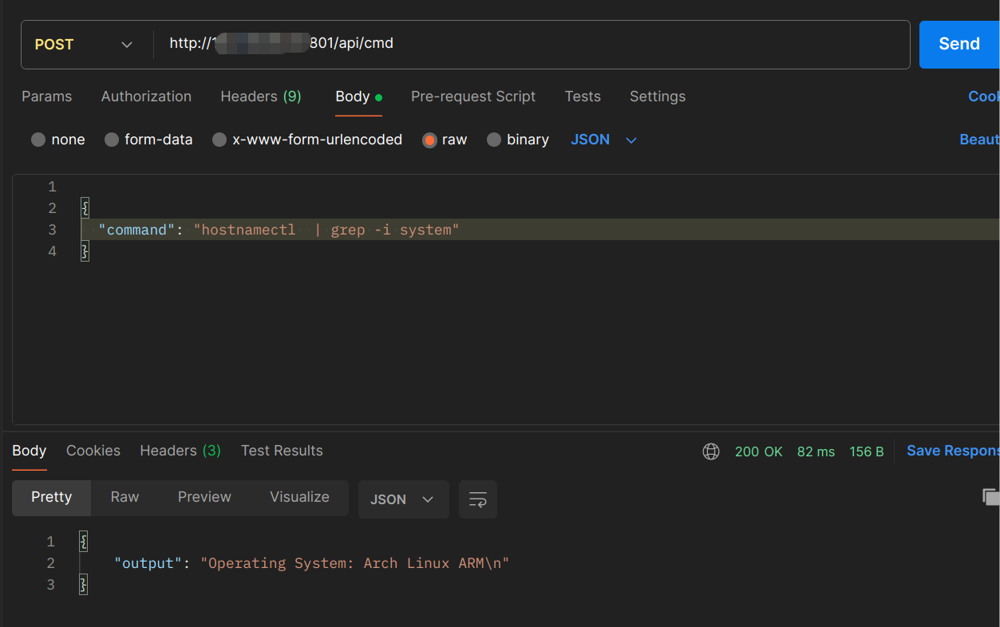

# jd_uz801

## uz801配置详情
| 项目 | 参数 |
|-----|------|
|CPU|MSM8916(高通410)|
|RAM|385MiB|
|ROM|3.82GiB|
|购入价|4.4 (我是大冤种，我哭死)|


## 使用简介

如果是刷的Archlinux，可以一键执行

```shell
pacman -S smsforwarder-beta-3-aarch64.pkg.tar.xz
```
安装完成后进入/opt/smsforwarder进行配置
```shell
cd /opt/smsforwarder
```
编辑conf.yml,配置为自己的转发渠道。保存后直接重启棒子或者重启短信转发服务
```shell
systemctl restart smsforwarder
```

写的比较垃圾，仅供学习。不要喷我行不行呀 好哥哥

## 刷入后优化
### 1、关闭所有led灯, 已经集成到beta3版本里面了 

如果是Archlinux 安装后会自动关闭

```shell
echo 0 > /sys/class/leds/green:internet/brightness
echo 0 > /sys/class/leds/blue:wifi/brightness
echo 0 > /sys/class/leds/mmc0::/brightness
```
### 修改中文
```shell
nano  /etc/locale.conf
# 将内容修改成下面的内容
LANG=zh_CN.UTF-8
```
或者用echo 直接重定向，这个准备后续集成到软件包内
```shell
echo 'LANG=zh_CN.UTF-8' >/etc/locale.conf 
```

### 修改主机名
```shell
hostnamectl set-hostname SIM-号码

# 替换hosts文件原有的主机名
sed -i 's/UFI-Arch/SIM-号码/' /etc/hosts
```

###  修改密码
将root密码修改为自己记得住的
```shell
passwd root
```


## 版本说明

已实现功能：

* 接收短信

* 转发短信

  * qq
  * wx
  * mail
  * 自定义的GET/POST 请求

* 发送短信

  * 端口 801
  * 路径 /api/sendMessage
  * GET参数
    * number
    * message

* 获取验证码

  * 端口 801
  * 路径： /api/getMessage

* 保存短信,暂时存在message.txt中

* 清理短信(规划中...)

  ...




